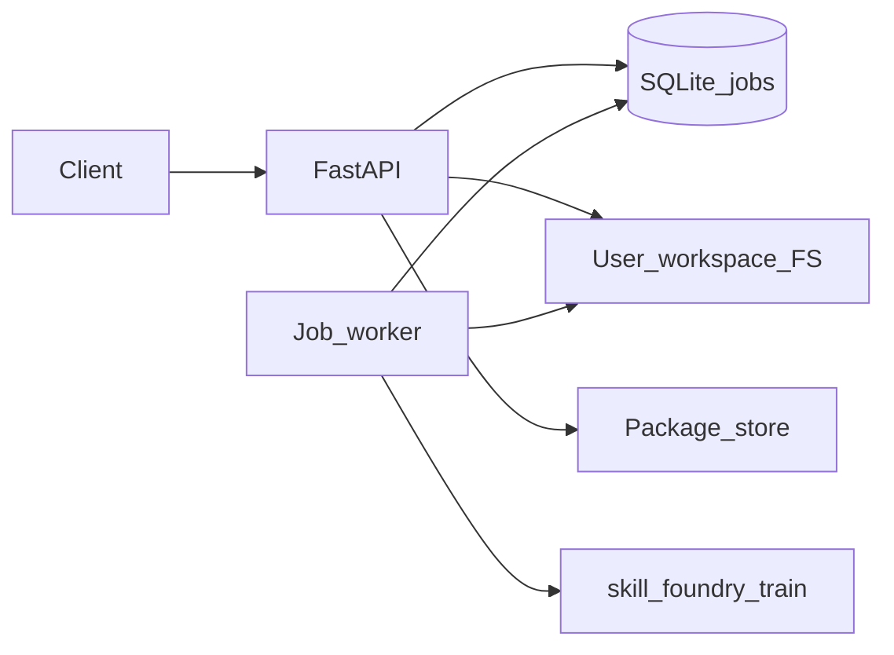

# Skill Foundry: Phase 5 — Platform (orchestrator & distribution)

This document specifies tasks **5.1** (Training orchestrator) and **5.2** (catalog & access control) from [03_implementation_plan.md](03_implementation_plan.md). It matches [02_architecture.md](02_architecture.md) §5 (Training orchestrator) and §9 (Distribution).

**Status:** implemented in `web/backend` (MVP). Queue and metadata use **SQLite**; workers run **async** in the API process. Replace with Redis/Celery/SQS for horizontal scaling when needed.

## Role in the pipeline

- **Phase 3** ([08_phase3_rl_worker_docker.md](08_phase3_rl_worker_docker.md), [09_phase3_env_rewards.md](09_phase3_env_rewards.md)): `skill-foundry-train` runs locally or in Docker.
- **Phase 4** ([10_phase4_manifest_export.md](10_phase4_manifest_export.md)): `skill-foundry-package pack` produces `skill_bundle.tar.gz` + `manifest.json`.
- **Phase 5 (this doc):** API **enqueues** training jobs with per-user workspaces, **limits** concurrency and wall-clock time, and exposes a **package catalog** with owner-only or published download access.
- **Phase 6.1** ([12_phase6_product_validation.md](12_phase6_product_validation.md)): **product validation** metadata on packages and a **publish gate** (`PATCH` with `published: true` requires successful validation unless `G1_SKIP_VALIDATION_GATE`).

## Task 5.1 — Training orchestrator

### Job model (contract)

| Field | Description |
|--------|-------------|
| `job_id` | UUID string |
| `user_id` | Tenant/user identifier (from `X-User-Id` or dev default) |
| `status` | `queued` \| `running` \| `succeeded` \| `failed` \| `cancelled` \| `rejected` |
| `mode` | `smoke` \| `train` \| `amp` (passed to `skill-foundry-train`) |
| `created_at`, `started_at`, `finished_at` | ISO 8601 timestamps (UTC) |
| `error_message` | Set when `failed` or `rejected` |
| `exit_code` | Subprocess exit code when finished |
| `workspace_path` | Absolute path under platform data dir: `users/<user_id>/jobs/<job_id>/` |

Inputs are materialized inside the workspace before the worker runs:

- `reference_trajectory.json` — ReferenceTrajectory v1 (copied from request body or user artifact file).
- `demonstration_dataset.json` — optional.
- `train_config.json` — training config with **`output_dir`** forced to `<workspace>/train_out` so outputs stay isolated.

### Queue semantics

- **MVP:** SQLite row per job; a single asyncio worker loop claims the oldest `queued` job that passes per-user concurrency checks.
- **At-least-once:** worker should tolerate restarts; claiming uses `UPDATE ... WHERE status='queued'` in a transaction. Idempotency: if a job is already `running`, do not start a second process for the same `job_id`.
- **Timeouts:** wall-clock `job_timeout_sec` (settings). On expiry the worker marks the job `failed` (best-effort; subprocess may still run until process exit unless extended with OS kill — future work).

### Quotas (MVP)

- `max_concurrent_jobs_per_user` — maximum jobs in `running` per `user_id`. Excess enqueue returns **409** with `status: rejected`.

### Isolation

- All job files live under `G1_PLATFORM_DATA_DIR/users/<user_id>/jobs/<job_id>/`.
- User **artifacts** (optional uploads) under `.../users/<user_id>/artifacts/<safe_name>`.
- Packages under `.../users/<user_id>/packages/<package_id>.tar.gz`.
- Async training requests must **not** rely on arbitrary server paths for reference/config; use inline JSON or paths relative to the user artifact area (see API below).

## Task 5.2 — Catalog and permissions (Distribution)

### Package entity (MVP)

| Field | Description |
|--------|-------------|
| `package_id` | UUID |
| `owner_user_id` | Creator |
| `label` | Optional display name |
| `published` | If true, any authenticated user may download |
| `bundle_path` | Relative path to `.tar.gz` under owner’s package directory |
| `created_at` | ISO timestamp |
| `validation_passed` | `1` = passed product validation, `0` = failed, `NULL` = unknown / not present (SQLite) |
| `validation_summary` | JSON string: metrics, `failure_reasons`, or manifest snapshot |

Manifest contract for bundle contents remains [contracts/export/export_manifest.schema.json](contracts/export/export_manifest.schema.json).

### Access rules

- **List:** `GET /api/packages` returns only packages owned by the caller **or** `published=true`.
- **Download:** allowed if `owner == caller` **or** `published`.
- **Publish:** owner-only `PATCH` to set `published` (MVP). Setting **`published: true`** requires **`validation_passed == 1`** (Phase 6.1), unless **`G1_SKIP_VALIDATION_GATE`** is enabled for development.

**Future:** marketplace listings, licenses, signed URLs — see Phase 6 in [03_implementation_plan.md](03_implementation_plan.md).

### Download integrity (Phase 6.2)

The API streams the same `.tar.gz` that was uploaded or produced by `skill-foundry-package`. **Trust** is TLS to the platform host plus **access control** above. Clients should run **`skill-foundry-runtime`** (or equivalent) which re-verifies **`weights.sha256`**, MJCF, and reference hashes from `manifest.json` ([13_phase6_runtime_security.md](13_phase6_runtime_security.md)). **Future:** optional checksum or signature headers on `GET .../download`, or detached package signatures pinned on the robot.

## REST API (MVP)

All platform routes expect identity header **`X-User-Id`** (non-empty string). If missing, **`G1_DEV_USER_ID`** is used (default `local-dev`) — **not for production**.

| Method | Path | Description |
|--------|------|-------------|
| `POST` | `/api/platform/artifacts/{name}` | Upload JSON artifact; `name` must match `^[a-zA-Z0-9_.-]+$`. Body: raw JSON. |
| `POST` | `/api/jobs/train` | Enqueue training. Body: `CreateTrainJobRequest` (see below). Returns `{ "job_id", "status" }`. |
| `GET` | `/api/jobs/{job_id}` | Job status and metadata; logs from workspace files if present. |
| `GET` | `/api/jobs` | List current user’s jobs (recent first, optional `limit`). |
| `POST` | `/api/packages/from-job/{job_id}` | After `succeeded`, run `skill-foundry-package pack` into owner workspace and register a package row. |
| `POST` | `/api/packages/upload` | Multipart `file` (`.tar.gz` skill bundle); registers package for user. |
| `GET` | `/api/packages` | List visible packages; each item includes `validation_passed`, `validation_summary`. |
| `GET` | `/api/packages/{package_id}/download` | Stream bundle if allowed. |
| `PATCH` | `/api/packages/{package_id}` | Body: `{ "published": bool }` — owner only. **409** if `published: true` and validation did not pass (see Phase 6.1). |

### `POST /api/jobs/train` body (`CreateTrainJobRequest`)

- `config` (object, required) — training config; `output_dir` is overwritten by the server.
- One of:
  - `reference_trajectory` (object) — written to workspace as ReferenceTrajectory JSON, **or**
  - `reference_artifact` (string) — filename under `users/<user_id>/artifacts/`.
- Optional: `demonstration_dataset` (object) or `demonstration_artifact` (string).
- `mode`: `smoke` \| `train` \| `amp` (default `smoke`).

The synchronous pipeline **`POST /api/pipeline/train`** is unchanged for local/dev use; it does not use the queue or isolation guarantees.

## Environment variables

| Variable | Description |
|----------|-------------|
| `G1_PLATFORM_DATA_DIR` | Root for SQLite DB, job workspaces, packages (default: `<repo>/web/backend/data/platform`). |
| `G1_JOB_TIMEOUT_SEC` | Wall-clock timeout per job (default `7200`). |
| `G1_MAX_CONCURRENT_JOBS_PER_USER` | Parallel `running` jobs per user (default `1`). |
| `G1_DEV_USER_ID` | Fallback user when `X-User-Id` absent (default `local-dev`). |
| `G1_PLATFORM_WORKER_ENABLED` | If `0`, worker loop does not start (enqueue still works; jobs stay `queued`). |
| `G1_SKIP_VALIDATION_GATE` | If `1` / `true`, allow publishing without `validation_passed == 1` (**dev only**). |

## Definition of done (tasks 5.1–5.2, MVP)

- Two users with different `X-User-Id` enqueue jobs; workspaces and listings do not cross over.
- Jobs transition `queued` → `running` → `succeeded` \| `failed` with stored exit code and logs path.
- Package download denied for another user’s private package; allowed when `published` or owner.

## Related code

- `web/backend/app/main.py` — routes, lifespan worker start.
- `web/backend/app/config.py` — platform settings.
- `web/backend/app/platform_*` — DB, job repository, worker, package helpers.

## Related documents

- [03_implementation_plan.md](03_implementation_plan.md) — Phase 5 tasks.
- [02_architecture.md](02_architecture.md) — module diagram.
- [10_phase4_manifest_export.md](10_phase4_manifest_export.md) — bundle layout and `skill-foundry-package`.
- [12_phase6_product_validation.md](12_phase6_product_validation.md) — validation report, thresholds, publish gate.
- [13_phase6_runtime_security.md](13_phase6_runtime_security.md) — package integrity at runtime, hardware safety checklist.
