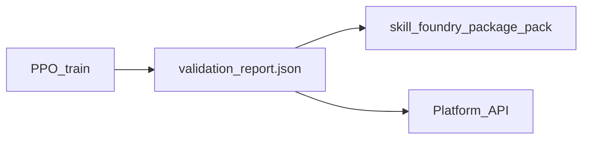

# Skill Foundry: Phase 6.1 — Product validation (thresholds)

This document specifies task **6.1** from [03_implementation_plan.md](03_implementation_plan.md): **automatic validation report** (tracking error and falls), **product thresholds**, and **blocking catalog publication** when validation fails.

**Naming:** Phase 0 **schema validation** (keyframes, ReferenceTrajectory JSON, etc.) lives in `skill_foundry_phase0.contract_validator` — see [04_phase0_contracts.md](04_phase0_contracts.md) §5. **This document** covers **product validation** of a **trained policy** (Phase 6).

## Role in the pipeline



1. After **Phase 3.2** PPO training (`skill-foundry-train --mode train`), the worker writes **`validation_report.json`** next to `train_run.json` unless disabled via train config (see below).
2. **Phase 4** packaging copies that file into the `.tar.gz` when present and adds a **`product_validation`** summary to **`manifest.json`**.
3. **Phase 5** platform stores **`validation_passed`** / **`validation_summary`** on package rows and **rejects** `published: true` unless validation succeeded (unless `G1_SKIP_VALIDATION_GATE=1`).

## Metrics (definitions)

Evaluation uses **`G1TrackingEnv`** with the **same** reference trajectory and env settings as training. For **N** episodes with deterministic policy actions:

| Metric | Definition |
|--------|------------|
| **`mean_tracking_error_mse`** | Mean of per-step **`mse_tracking`** (rad²) over **all steps** in all N episodes. `mse_tracking` is the mean squared error between measured motor positions and reference at that time (see `g1_tracking_env.py`). |
| **`fall_episodes`** | Count of episodes that **terminated** because the base height dropped below **`min_base_height`** (`info["fallen"]` on the terminating step). |
| **`mean_of_episode_mean_mse`** | Mean of (per-episode average `mse_tracking`); diagnostic only; thresholds use **`mean_tracking_error_mse`**. |

Seeds: episode *i* uses `reset(seed=val_seed + i)` with **`val_seed`** from `product_validation.val_seed`, or `early_stop.val_seed`, or **`seed + 1`** from the train config.

## Threshold file

Default bundled file:

- `unitree_sdk2_python/skill_foundry_rl/validation_thresholds.default.yaml`

Fields:

| Field | Meaning |
|-------|---------|
| `schema_version` | Report/thresholds file version string |
| `profile` | Logical name (`default`); future: per-skill-type profiles |
| `n_episodes` | Number of evaluation episodes |
| `max_mean_mse` | Fail if **`mean_tracking_error_mse`** > this value |
| `max_fall_episodes` | Fail if **`fall_episodes`** > this value |

**Product owners** should replace placeholder numbers after measuring acceptable quality on reference motions.

## `validation_report.json`

- **`validation_report_schema_ref`**: `skill_foundry_product_validation_report_v1`
- **`applicable`**: `false` only for future “skipped” modes; normal train path is `true`
- **`passed`**: whether all threshold checks passed
- **`failure_reasons`**: `[{ "code", "message" }, ...]` for UI (e.g. `tracking_mse_too_high`, `too_many_falls`, `validation_error`)
- **`metrics`**: aggregates listed above
- **`thresholds_applied`**: snapshot of thresholds used
- **`thresholds_path`**, **`reference_sha256`**, **`mjcf_sha256`**, **`checkpoint_path`**, **`val_seed`**
- **`error`**: set when validation could not run (invalid thresholds, load failure, etc.); then **`passed`** is `false`

## Train config (`product_validation`)

Optional block in the same JSON/YAML as PPO training:

```yaml
product_validation:
  enabled: true          # set false to skip writing validation_report.json (e.g. CI smoke)
  thresholds_path: null  # default: bundled validation_thresholds.default.yaml
  n_episodes: null       # override thresholds file only for this run
  val_seed: null         # override default val seed derivation
```

## CLI

```bash
skill-foundry-validate \
  --config /path/to/train_config.json \
  --reference-trajectory /path/to/reference_trajectory.json \
  --run-dir /path/to/train_out \
  -o /path/to/validation_report.json
```

Optional: `--checkpoint`, `--thresholds`, `--n-episodes`, `--val-seed`. Exit code **0** if `passed`, **1** if failed or error report.

## Manifest and bundle

- Optional archive member: **`validation_report.json`**
- Optional **`manifest.json`** key **`product_validation`**: filename, schema ref, `passed`, `metrics`, `applicable`

JSON Schema: [contracts/export/export_manifest.schema.json](contracts/export/export_manifest.schema.json) (`product_validation` property).

## Platform API (Phase 5 integration)

- **`GET /api/packages`**: each item includes **`validation_passed`** (`1` / `0` / `null`) and **`validation_summary`** (JSON string with metrics / failure reasons when present).
- **`POST /api/packages/from-job/{job_id}`**: reads `train_out/validation_report.json` when registering the package.
- **`POST /api/packages/upload`**: derives validation state from **`manifest.json` → `product_validation`** inside the tarball when present; otherwise **`validation_passed`** stays **`null`**.
- **`PATCH /api/packages/{package_id}`** with **`published: true`**: returns **409** if **`validation_passed != 1`** (unless **`G1_SKIP_VALIDATION_GATE=1`**). Response **`detail`** includes **`message`**, **`failure_reasons`**, **`metrics`**.

## Environment variables

| Variable | Description |
|----------|-------------|
| `G1_SKIP_VALIDATION_GATE` | If `1` / `true`, allow publishing without successful validation (**development only**). |

## Future (task 6.1 item 3)

Separate threshold **profiles** (e.g. dance vs. arm wave) selected by manifest metadata or catalog tags — not required for the current MVP.

## Related code

- `unitree_sdk2_python/skill_foundry_rl/product_validation.py` — metrics, thresholds, report builder
- `unitree_sdk2_python/skill_foundry_rl/validate_cli.py` — `skill-foundry-validate`
- `unitree_sdk2_python/skill_foundry_rl/ppo_train.py` — post-train validation hook
- `unitree_sdk2_python/skill_foundry_export/packaging.py` — bundle + manifest `product_validation`
- `web/backend/app/platform_packages.py`, `platform_db.py`, `main.py` — DB fields and publish gate

## Definition of done (task 6.1)

Thresholds are documented here and in the default YAML; training produces a report; packaging carries it; the platform blocks publication when validation did not pass, with a clear API error payload.

## Related (Phase 6.2)

Runtime integrity and field safety: [13_phase6_runtime_security.md](13_phase6_runtime_security.md).
