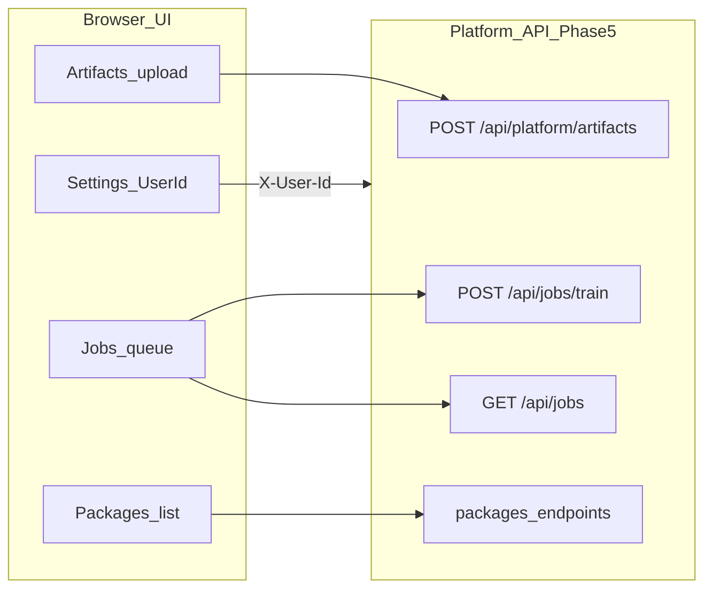

# Поэтапный план реализации фронтенда (F1–F17)

Дорожная карта **веб-UI** для **AUROSY Skill Factory**. Бэкенд, CLI и контракты данных развиваются в **репозитории бэкенда** (см. [backend_references.md](backend_references.md): `03_implementation_plan`, `frontend_developer_guide`); этот документ **не дублирует** задачи препроцессинга/обучения, только зависимости и экраны.

### Конечная цель и роль этого документа

Этот файл — **единый живой план** работ над веб-интерфейсом: при любых последующих правках и дополнениях целиться в **устойчивый продукт для внешних пользователей** — предсказуемый shell, согласованный UI/UX с [02_design_system.md](02_design_system.md) и [04_figma_design_brief.md](04_figma_design_brief.md), снижение когнитивной нагрузки на инженерных экранах и **самодостаточные справочные материалы** (в том числе FAQ). Фазы **F8+** продолжают F1–F7 и не отменяют их критериев готовности; фазы **F13+** описывают интеграцию с **Phase 5** бэкенда платформы (артефакты, очередь train, пакеты). Журнал реализации внизу документа обновляется по мере закрытия задач.

---

## Обозначения

- **DoD** — критерий готовности фазы с точки зрения UI.
- Зависимости от API предполагают запущенный бэкенд (запуск и порты — в README репозитория бэкенда, см. [backend_references.md](backend_references.md)).

---

## F1 — Каркас приложения

**Фокус:** маршрутизация, layout (sidebar + main), интеграция дизайн-токенов из [02_design_system.md](02_design_system.md), единый HTTP-клиент и обработка ошибок сети.

**Задачи:**

- Зафиксировать базовый URL API (env) и прокси в dev ([vite.config.ts](../../web/frontend/vite.config.ts)).
- Глобальные состояния ошибки (например баннер «бэкенд недоступен» при недоступности `GET /api/health`).
- Навигация ко всем будущим разделам (заглушки допустимы).

**API:** `GET /api/health`, `GET /api/meta`.

**DoD:** пользователь видит стабильный shell; при падении бэкенда UI не «молчит», а сообщает о проблеме.

**Риски:** смешение относительных и абсолютных URL — документировать в README фронта.

---

## F2 — Авторинг (Phase 0)

**Фокус:** работа с `keyframes`, `motion`, `scenario`: ввод JSON (редактор или формы поэтапно), клиентская валидация по JSON Schema из статики, серверная проверка.

**Задачи:**

- Подключить схемы из каталога контрактов (копия для фронта: [`web/frontend/public/contracts/`](../../web/frontend/public/contracts/); синхронизация с источником в репозитории бэкенда — см. [backend_references.md](backend_references.md)).
- Кнопка «Проверить на сервере» → `POST /api/validate` с `kind` и `payload`.
- Отображение списка ошибок валидации понятным списком.

**DoD:** пользователь может отредактировать три типа артефактов и получить согласованный результат validate; golden-примеры из каталога бэкенда (`docs/skill_foundry/golden/v1/` — см. [backend_references.md](backend_references.md)) открываются без ошибок.

**Риски:** расхождение версии схемы на клиенте и сервере — версионировать и отображать `schema_version` в UI.

**Зависимость от бэкенда:** контракт `POST /api/validate` стабилен (Phase 0 уже зафиксирован в документации).

---

## F3 — Телеметрия и экспертные слайдеры

**Фокус:** `GET /api/joints` для отображения групп и имён; WebSocket `/ws/telemetry` для потока углов; опциональное сравнение цели и факта, если бэкенд отдаёт оба.

**Задачи:**

- Таблица или набор слайдеров по группам суставов (как в Pose Studio по смыслу).
- Переподключение WS при обрыве с индикацией.

**DoD:** непрерывное обновление значений в UI в mock-режиме; отображение соответствует группам из API.

**Риски:** частота сообщений и производительность React — при необходимости троттлинг обновлений отрисовки.

---

## F4 — Визуальный Pose-слой

**Фокус:** центральный визуал робота (2D PNG + hotspots и/или 3D из STL + MJCF), подписи зон тела, связь с выбранным суставом; соответствие §3.0 `frontend_developer_guide` в репозитории бэкенда ([backend_references.md](backend_references.md)).

**Задачи:**

- Минимум: схема из ассетов §1.4 + кликабельные зоны → фильтр суставов в боковой панели.
- Расширение: WebGL-сцена с синхронизацией углов из того же состояния, что и слайдеры.

**API:** `GET /api/joints`; опционально телеметрия для наложения «факта» на визуал.

**DoD:** основной поток не требует чтения сырой таблицы 29× чисел для типовой задачи позирования.

**Риски:** загрузка больших STL; согласование осей с MJCF — инженерная задача, заложить спайки на итерации.

---

## F5 — Сценарии (mid-level + estimate)

**Фокус:** список действий с диска, сборка нод, вызов `POST /api/scenario/estimate`, предупреждение при выходе за целевое окно длительности (~25–35 с, ориентир ~30 с как в десктопном Scenario Studio).

**Задачи:**

- Таблица/каталог из `GET /api/mid-level/actions`.
- Редактор цепочки: subdir, action_name, speed, repeat; при необходимости подстановка `keyframe_count` для оценки.
- Отображение `estimated_seconds` по нодам и `total_estimated_seconds`.

**DoD:** пользователь собирает сценарий и видит оценку до запуска на роботе.

**Риски:** эвристика длительности на бэкенде может меняться — не зашивать числа в UI, показывать предупреждения как текст из продукта.

---

## F6 — Конвейер (preprocess → playback → train)

**Фокус:** формы для `POST /api/pipeline/preprocess`, `playback`, `train`; отображение `exit_code`, stdout/stderr; работа с путями к файлам на хосте бэкенда; индикация наличия CLI `GET /api/pipeline/detect-cli`.

**Задачи:**

- Для каждого этапа — понятные поля (см. OpenAPI), блок логов, статус.
- Обработка больших ответов (артефакты, base64) — не блокировать UI; по возможности ссылки на скачивание или усечённый превью.

**DoD:** один сквозной сценарий «keyframes → validate → preprocess → playback» выполняется из UI при корректной конфигурации машины.

**Риски:** безопасность путей и размер тел — политика на бэкенде; фронт показывает предупреждения при ошибках subprocess.

---

## F7 — Полировка

**Фокус:** онбординг (первый запуск), опциональная i18n, оптимизация больших JSON (виртуализация списков, ленивая подсветка), `prefers-reduced-motion`, документация для пользователя.

**Задачи:**

- Краткий тур по зонам тела и основным действиям (см. §3.0).
- Профилирование при больших keyframes.

**DoD:** команда может передать UI внешнему пользователю без обязательного чтения исходников.

---

## F8 — Информационная архитектура, главная и настройки

**Фокус:** выровнять навигацию и входную точку с продуктовым брифом ([04_figma_design_brief.md](04_figma_design_brief.md)): понятный «центр управления», а не только список ссылок.

**Рекомендации (основание для задач):**

- Порядок пунктов sidebar: приоритет **творческого цикла** (Authoring → Pose Studio рядом) перед вспомогательными разделами; целевая ширина сайдбара **260–280px** (сейчас уже́ в коде может отличаться — сверить с макетом).
- **Главная (Home):** карточки-шорткаты в разделы, явный блок статуса API (дублирование смысла с баннером допустимо для сканирования страницы), заготовка под «последние черновики», когда появятся.
- **Settings / About:** маршрут с базовым URL (`VITE_API_BASE`), язык, ссылка на документацию, версия/meta при необходимости.

**Задачи:**

- Реорганизовать порядок `NavLink` и при необходимости группировку визуально.
- Расширить экран `/` до dashboard-паттерна из брифа.
- Добавить минимальный `/settings` (или модальное окно), не дублируя всё из README без нужды.

**DoD:** новый пользователь за один экран понимает статус системы и куда идти дальше.

**Риски:** не раздувать главную техническим текстом — приоритет действиям и статусу.

---

## F9 — Визуальная полнота дизайн-системы

**Фокус:** закрыть разрыв между [02_design_system.md](02_design_system.md) / брифом Figma и реализацией: «стекло/сланец», вторичный акцент, единые паттерны обратной связи.

**Рекомендации:**

- Карточки: усилить **elevated / glass** (полупрозрачность, граница) без потери контраста AA.
- **Вторичный цвет** (`--color-secondary`): системно для вторичных CTA, тегов, режима «эксперт».
- Компоненты из брифа, ещё не везде внедрённые: **Toast**, **EmptyState**, единый **ValidateBanner**-стиль, **PageHeader** (заголовок + краткое описание + primary action справа).

**Задачи:**

- Вынести повторяющиеся блоки в переиспользуемые компоненты; добавить тосты для успеха/ошибки сети где уместно.
- Пустые состояния для каталогов и пустых цепочек сценария — с CTA.

**DoD:** интерфейс визуально читается как один продукт, а не набор страниц.

---

## F10 — Улучшения ключевых потоков (экраны)

**Фокус:** снизить трение в уже существующих экранах; согласовать с принципами UX из [02_design_system.md](02_design_system.md) (визуал в центре, экспертный слой вторичен).

**Рекомендации по экранам:**

| Область | Улучшение |
|--------|------------|
| **Authoring** | Кнопки **Format / Copy** для JSON; явный показ **schema_version** рядом с табами; по возможности связь строки ошибки валидации с фрагментом JSON. |
| **Pose Studio** | Пока ассеты placeholder — **состояние «ожидаем ассеты §1.4»** на центральной области; эксперт-блок **свёрнут по умолчанию**, если ещё не так. |
| **Telemetry vs Pose** | Развести **микрокопи**: Telemetry = поток/мониторинг; Pose = настройка позы — чтобы не путать сценарии использования. |
| **Сценарии** | **Drag-and-drop** порядка нод; **авто-оценка** с debounce после изменения полей (см. журнал F5 — сейчас вне scope). |
| **Pipeline** | Визуальный **сквозной narrative** этапов (1 → 2 → 3), рекомендуемый порядок; при появлении стадий на бэкенде — индикатор прогресса. |

**Задачи:** реализовать построчно по приоритету продукта; фиксировать в журнале реализации.

**DoD:** типовой сценарий «авторинг → валидация → preprocess → playback» воспринимается как одна история без лишних кликов.

---

## F11 — Доступность и снижение когнитивной нагрузки

**Фокус:** соответствие заявленному в дизайн-системе: фокус, статусы не только цветом, уважение к `prefers-reduced-motion`.

**Рекомендации:**

- Единое **`:focus-visible`** для ссылок, кнопок, табов (кольцо primary).
- Бейджи статусов конвейера: **иконка + текст** («Ошибка», «Готово», «Выполняется»).
- Анимации «running» с отключением при `prefers-reduced-motion: reduce`.
- Слайдеры: проверка **aria** и подписей в эксперт-режиме.

**Задачи:** аудит интерактивов; правки CSS/компонентов; онбординг-тур (короткий) — остаётся частью полировки, см. F7.

**DoD:** основные сценарии проходимы с клавиатуры; статусы однозначны без цвета.

---

## F12 — FAQ для пользователей (Customer Experience)

**Фокус:** один консолидированный ответ на частые вопросы без чтения исходников и разрозненных README — опора для внешней передачи UI (см. DoD F7 и конечную цель документа).

**Задачи:**

- Создать **FAQ** (формат вопрос–ответ): типовые темы — доступность бэкенда и `VITE_API_BASE`, авторинг keyframes/motion/scenario, клиентская и серверная валидация, Pose Studio и ассеты, телеметрия и WebSocket, сценарии и окно длительности, конвейер и CLI, ошибки pipeline, смена языка (i18n).
- **Источники контента:** `docs/g1-control-ui/`, README фронта и веб-папки, [backend_references.md](backend_references.md), контракты в `web/frontend/public/contracts/`, фактическое поведение UI и API.
- **Составление текстов:** **ассистент (AI) выступает в роли Customer Experience-эксперта** — на основе данных платформы и перечисленной документации формирует структуру и черновик ответов; обязателен **человеческий ревью** на фактическую точность перед публикацией.
- **Поставка:** файл в репозитории (например `docs/g1-control-ui/FAQ.md` или отдельный пользовательский гайд) и при необходимости экран **«Справка / FAQ»** в приложении с ключами i18n.

**DoD:** команда может дать внешнему пользователю ссылку на FAQ; ответы согласованы с текущей версией UI и документов.

**Риски:** расхождение FAQ с новым API — при изменениях контрактов обновлять FAQ и при необходимости указывать версию схемы/приложения.

---

## F13–F17 — Интеграция с бэкендом платформы (Phase 5)

Эти фазы продолжают F1–F12 и **не отменяют** их критериев готовности. Цель — довести связку **веб-приложение + бэкенд платформы** до рабочего цикла для пользователей: **артефакты → очередь асинхронного train → просмотр статуса и логов → упаковка Skill Bundle → при необходимости публикация**. Реализация HTTP-маршрутов — в репозитории бэкенда (`web/backend/app/main.py`, зависимости `app/deps.py`, настройки `app/config.py`); перечень Phase 5 и заголовок `X-User-Id` — в [backend_references.md](backend_references.md). Детали тел запросов — OpenAPI у запущенного сервера (`GET /docs`).

---

## F13 — Идентичность и HTTP-клиент платформы

**Фокус:** все маршруты Phase 5, защищённые `Depends(get_user_id)`, должны получать согласованный идентификатор пользователя: заголовок **`X-User-Id`** или fallback **`G1_DEV_USER_ID`** на бэкенде, если заголовок не передан (режим разработки).

**Задачи:**

- Зафиксировать в конфигурации фронта способ задания User ID: например переменная окружения сборки (`VITE_PLATFORM_USER_ID` или согласованное имя) и/или поле в **Настройках** с сохранением в `localStorage` (приоритет — по решению команды; документировать в README фронта).
- Ввести единую обёртку над `fetch` (или расширить [`web/frontend/src/api/client.ts`](../../web/frontend/src/api/client.ts)) для вызовов Phase 5: автоматическая подстановка заголовка `X-User-Id` для `/api/platform/*`, `/api/jobs*`, `/api/packages*`.
- Убедиться, что типовой dev-сценарий (один пользователь, `local-dev`) не приводит к **403** из‑за несовпадения user id между сохранением артефакта и чтением job.

**API:** заголовок `X-User-Id` ко всем защищённым эндпоинтам Phase 5 (см. [backend_references.md](backend_references.md)).

**DoD:** запросы к списку jobs / packages с корректно настроенным клиентом проходят авторизацию на уровне «владелец ресурса»; в UI видно, под каким идентификатором выполняются операции (хотя бы в Настройках).

**Риски:** утечка произвольного `X-User-Id` в продакшене без настоящей аутентификации — за пределами UI; в дорожной карте зафиксировать, что **F13 — про согласованность dev/proxy**, а полноценный login — отдельная тема бэкенда.

---

## F14 — Артефакты и асинхронное обучение (jobs)

**Фокус:** сохранение крупных JSON на стороне платформы и постановка **асинхронного** train в изолированный workspace с опросом статуса и хвостами логов.

**Задачи:**

- UI для **`POST /api/platform/artifacts/{name}`**: сохранение тела JSON (например результат preprocess / `reference_trajectory`) с валидацией имени артефакта на стороне сервера.
- Форма **`POST /api/jobs/train`**: ровно один источник reference — `reference_trajectory` **или** `reference_artifact`; опционально demonstration — объект **или** артефакт; режим `smoke` / `train`; обработка **400** с телом ошибки постановки в очередь (`EnqueueError`).
- Экран или вкладка **«Задачи»**: **`GET /api/jobs`** (список), **`GET /api/jobs/{job_id}`** (детали: `status`, `exit_code`, `stdout_tail`, `stderr_tail`); polling с разумным интервалом; пустые и ошибочные состояния.

**API:** `POST /api/platform/artifacts/{name}`, `POST /api/jobs/train`, `GET /api/jobs`, `GET /api/jobs/{job_id}`.

**DoD:** пользователь проходит цикл «сохранить артефакт → поставить train в очередь → видеть статус и хвосты логов до завершения или ошибки».

**Риски:** длительные job и размер логов — не рендерить безлимитно; worker должен быть включён (`G1_PLATFORM_WORKER_ENABLED`) — иначе очередь не обработается (см. F17).

---

## F15 — Пакеты Skill Bundle

**Фокус:** выпуск `.tar.gz` после успешного train, загрузка бандлов, список, скачивание и **публикация** с учётом gate валидации продукта на бэкенде.

**Задачи:**

- После **`status: succeeded`** у job — действие **`POST /api/packages/from-job/{job_id}`** и отображение `package_id`.
- Список **`GET /api/packages`**: таблица с `label`, `published`, `created_at`, сводкой валидации при наличии полей.
- Скачивание **`GET /api/packages/{package_id}/download`** (файл `skill_bundle.tar.gz`).
- Загрузка **`POST /api/packages/upload`** (multipart, только `.tar.gz`).
- **`PATCH /api/packages/{package_id}`** с телом `{ "published": true }`: обработка **409** с детализацией (`validation_passed`, `failure_reasons`, подсказка про `G1_SKIP_VALIDATION_GATE` только для разработки — текст из ответа API, не хардкодить бизнес-логику).

**API:** `POST /api/packages/from-job/{job_id}`, `GET /api/packages`, `GET /api/packages/{package_id}/download`, `POST /api/packages/upload`, `PATCH /api/packages/{package_id}`.

**DoD:** выпуск и при необходимости публикация бандла выполняются из UI без обхода через `curl`; пользователь понимает, почему publish запрещён (сообщение сервера).

**Риски:** крупные архивы — индикация загрузки/скачивания; после появления экранов обновить **[FAQ.md](FAQ.md)** и ключи **`/help`** (F12): User ID, очередь train, пакеты, publish gate.

---

## F16 — Информационная архитектура: Pipeline ↔ Platform

**Фокус:** явно развести в продукте два пути **train**: синхронный subprocess (**`POST /api/pipeline/train`**, текущий Конвейер) и асинхронный **платформенный** train (**`POST /api/jobs/train`** + worker + пакеты).

**Задачи:**

- Копирайт и подсказки на **Главной** и **Конвейере**: когда уместен быстрый локальный train, когда — постановка в очередь (изоляция workspace, лимиты concurrent jobs per user на бэкенде).
- Опционально: CTA «Отправить в очередь обучения» из контекста успешного preprocess (передача reference в артефакт или прямо в job — по контракту).
- Навигация: пункты сайдбара или вложенная группа для **Задачи** / **Пакеты** без дублирования опасных действий без подтверждения (повторный train, перезапись артефактов).

**API:** использует уже перечисленные в F6 и F14–F15.

**DoD:** новый пользователь понимает, какой путь выбрать; нет случайного двойного запуска train без осознанного действия.

**Риски:** расхождение терминов «Конвейер» и «Платформа» — выровнять с [01_frontend_architecture.md](01_frontend_architecture.md) и FAQ.

---

## F17 — Надёжность и продакшен (совместно с бэкендом)

**Фокус:** согласовать развёртывание и ограничения текущей сборки с чеклистом для «полного» опыта пользователей.

**Задачи:**

- **Телеметрия WebSocket:** при `telemetry_mode: dds` / `G1_USE_DDS_TELEMETRY=1` в типовой сборке мост DDS может быть не реализован — соединение закрывается с сообщением об ошибке; в UI/FAQ зафиксировать рекомендацию использовать mock-телеметрию до готовности моста (обновить F12 при необходимости).
- **Worker:** документировать зависимость очереди jobs от фонового цикла (`G1_PLATFORM_WORKER_ENABLED`, таймауты `job_timeout_sec`).
- **CORS и credentials:** в dev часто `allow_origins=["*"]`; для продакшена — сузить origins и при необходимости скорректировать настройки запросов на фронте.

**API:** поведение `WS /ws/telemetry` и переменные окружения — в README/OpenAPI репозитория бэкенда.

**DoD:** чеклист развёртывания (фронт + бэкенд) согласован: пользователь не остаётся без объяснения при «тихом» незапуске worker или недоступной DDS-телеметрии.

**Риски:** без реализации DDS-моста на бэкенде UI не заменит инженерную настройку хоста — F17 фиксирует ожидания, а не реализацию драйвера.

---

## Сводная таблица фаз

| Фаза | Фокус | Ключевые API |
|------|--------|----------------|
| F1 | Shell, API health/meta | `/api/health`, `/api/meta` |
| F2 | Авторинг + validate | `POST /api/validate` |
| F3 | Телеметрия, слайдеры | `/api/joints`, `WS /ws/telemetry` |
| F4 | Pose визуал | `/api/joints` + ассеты |
| F5 | Сценарии | `/api/mid-level/actions`, `POST /api/scenario/estimate` |
| F6 | Pipeline | `POST /api/pipeline/*`, `GET /api/pipeline/detect-cli` |
| F7 | UX и производительность | — |
| F8 | IA, Home dashboard, Settings | `/api/health`, `/api/meta` |
| F9 | Визуальная полнота DS, Toast, EmptyState | — |
| F10 | Улучшения потоков по экранам | по затронутым экранам |
| F11 | a11y, motion, статусы | — |
| F12 | FAQ (CX), справка в приложении | — |
| F13 | Идентичность платформы, `X-User-Id` | заголовок ко всем Phase 5 маршрутам |
| F14 | Артефакты, очередь train, jobs | `POST /api/platform/artifacts/{name}`, `POST /api/jobs/train`, `GET /api/jobs`, `GET /api/jobs/{id}` |
| F15 | Пакеты Skill Bundle | `POST /api/packages/from-job/{id}`, `GET/PATCH /api/packages`, `download`, `upload` |
| F16 | IA: синхронный Pipeline vs async platform | как в F6 + F14–F15 |
| F17 | Продакшен: WS DDS, worker, CORS | `WS /ws/telemetry`, env бэкенда |

---

## Связанные документы

- [01_frontend_architecture.md](01_frontend_architecture.md)
- [02_design_system.md](02_design_system.md)
- [04_figma_design_brief.md](04_figma_design_brief.md)
- [backend_references.md](backend_references.md) — документы и пути в репозитории бэкенда; **Phase 5** (артефакты, jobs, packages, `X-User-Id`) — отдельная таблица в том файле
- Точка входа HTTP/WebSocket в репозитории бэкенда: **`web/backend/app/main.py`**
- Пользовательский **FAQ:** [`FAQ.md`](FAQ.md) в этой папке; экран приложения — **`/help`** (см. журнал F12 ниже); раздел про платформу дополнен пакетами (**F15**) и переносом reference из Конвейера (**F16**, журнал F16 ниже); продакшен-чеклист — [`DEPLOYMENT.md`](DEPLOYMENT.md) (**F17**, журнал F17 ниже)

---

## Журнал реализации (обновлять по мере фаз)

### F4 — визуальный Pose-слой (2026-04-08)

**Сделано:**

- Экран **Pose Studio** ([`web/frontend/src/pages/PoseStudio.tsx`](../../web/frontend/src/pages/PoseStudio.tsx)), маршрут `/pose`, пункт навигации «Pose Studio».
- Компонент **RobotDiagram** ([`web/frontend/src/components/RobotDiagram.tsx`](../../web/frontend/src/components/RobotDiagram.tsx)): фоновое изображение [`web/frontend/public/pose/robot-diagram.svg`](../../web/frontend/public/pose/robot-diagram.svg) (placeholder до подстановки ассетов из `frontend_developer_guide` §1.4 в репозитории бэкенда), SVG-overlay с зонами **по одной на каждую группу** из `GET /api/joints` (равные вертикальные полосы в нормализованных координатах 0–100). Клик по зоне включает фильтр панели суставов по этой группе; кнопка «Все группы» сбрасывает фильтр.
- Боковая панель переиспользует **JointTelemetryRow** (таблица/слайдеры, эксперт, °/rad); клик по строке подсвечивает сустав и синхронизирует подсветку зоны на схеме. Поток углов — тот же **WebSocket** `/ws/telemetry`, что на странице Телеметрии (обновление кадра уже ограничено `requestAnimationFrame` в хуке).
- Статика и заметки: [`web/frontend/public/pose/README.txt`](../../web/frontend/public/pose/README.txt), заготовка [`pose-overlay.json`](../../web/frontend/public/pose/pose-overlay.json) для будущих кастомных областей (сейчас overlay строится из API).

**Не в scope этой итерации:** WebGL/Three.js, STL и синхронизация с MJCF (расширение по дорожной карте после стабильного 2D).

**Соответствие гайду бэкенда:** визуальный центр и связь зон с группами/подписями суставов — §3.0; подключение официальных изображений — §1.4 (через замену файлов в `public/pose/`).

### F5 — Сценарии (mid-level + estimate) (2026-04-08)

**Сделано:**

- Экран **Сценарии** ([`web/frontend/src/pages/ScenarioBuilder.tsx`](../../web/frontend/src/pages/ScenarioBuilder.tsx)), маршрут `/scenarios` (без изменений навигации).
- **Каталог** `GET /api/mid-level/actions`: таблица с подписью, `subdir`/`action_name`, `keyframe_count`, кнопка «В сценарий»; дефолтные speed/repeat при добавлении; фильтр по тексту; состояния загрузки, ошибки загрузки, пустой каталог.
- **Цепочка:** редактируемые `speed`, `repeat`, `keyframe_count` по строкам; человекочитаемая подпись + путь; порядок нод кнопками ↑/↓; удаление строки. Любое изменение цепочки сбрасывает последнюю оценку (столбец «~ с» показывает «—» до повторного «Оценить»).
- **Оценка:** `POST /api/scenario/estimate` — столбец «~ с (оценка)» по нодам после успешного ответа, итог `total_estimated_seconds` под таблицей. Константы целевого окна в коде: `WARN_DURATION_MIN_SECONDS` / `MAX` (25–35 с), `TARGET_SCENARIO_SECONDS` (30); при выходе за окно — блок `warn-banner` ([`styles.css`](../../web/frontend/src/styles.css)).

**Не в scope этой итерации:** drag-and-drop сортировка нод, авто-оценка при каждом изменении поля.

**Соответствие roadmap F5 / брифу:** каталог таблицей, сборка нод, оценка по нодам и суммарно, предупреждение вне целевого окна длительности без жёсткой привязки текста к внутренней эвристике бэкенда.

### F6 — Конвейер (preprocess → playback → train) (2026-04-08)

**Сделано:**

- Экран **Конвейер** ([`web/frontend/src/pages/Pipeline.tsx`](../../web/frontend/src/pages/Pipeline.tsx)), маршрут `/pipeline`: блок **Phase 0** с `POST /api/validate` (`keyframes`) — список ошибок или сообщение об успехе; при ошибках валидации — `warn-banner` перед секцией preprocess (запуск preprocess по-прежнему доступен).
- **CLI / meta:** `GET /api/pipeline/detect-cli` — если любая из команд (`preprocess` / `playback` / `train`) в ответе `null`, показывается `warn-banner` про `PATH` и fallback `python -m …`; сбои загрузки `/api/meta` или `detect-cli` выводятся отдельно.
- **Вывод:** [`web/frontend/src/components/PipelineOutput.tsx`](../../web/frontend/src/components/PipelineOutput.tsx) — для preprocess: `exit_code`, stdout, stderr, `reference_trajectory_json`, `preprocess_run_json`; для playback/train — разбор `exit_code` / stdout / stderr и блок «прочие поля ответа»; длинные строки усечены (`MAX_PIPELINE_PREVIEW_CHARS`), кнопка «Показать полностью».
- **Состояния:** тип `busy`: `validate` | `preprocess` | `playback` | `train`, `aria-busy` на активной кнопке; при параллельном запросе остальные действия отключены; ранний выход из train без зависания `busy`.
- Типы в [`web/frontend/src/api/client.ts`](../../web/frontend/src/api/client.ts): `PreprocessPipelineResponse`, `PipelineSubprocessJsonResult`, `PlaybackRequestBody`, `TrainRequestBody`.

**Не в scope этой итерации:** отдельные endpoints для скачивания крупных артефактов; Web Worker для форматирования очень больших JSON.

**Соответствие roadmap F6:** сквозной сценарий keyframes → validate → preprocess → playback; крупные ответы не рендерятся целиком без явного раскрытия.

### F7 — i18n (ru/en) (2026-04-08)

**Сделано:**

- **Стек:** `i18next`, `react-i18next`, `i18next-browser-languagedetector`; инициализация в [`web/frontend/src/i18n/config.ts`](../../web/frontend/src/i18n/config.ts) (импорт из [`main.tsx`](../../web/frontend/src/main.tsx)).
- **Ресурсы:** [`web/frontend/src/locales/ru.json`](../../web/frontend/src/locales/ru.json), [`en.json`](../../web/frontend/src/locales/en.json) — пользовательские строки всех экранов (навигация, главная, авторинг, телеметрия, сценарии, конвейер, Pose Studio, баннер бэкенда, вывод pipeline).
- **Язык:** порядок определения — `localStorage` → язык браузера → fallback `ru`; переключатель **RU / EN** в сайдбаре ([`LanguageSwitcher.tsx`](../../web/frontend/src/components/LanguageSwitcher.tsx)); атрибут `document.documentElement.lang` синхронизируется при смене языка.
- **Сложная разметка:** `Trans` из `react-i18next` там, где в тексте встречаются `<code>` и ссылки.

**Не в scope этой итерации (прочая полировка F7):** интерактивный онбординг-тур, виртуализация больших JSON, `prefers-reduced-motion`, отдельная пользовательская PDF/README.

**Соответствие roadmap F7:** двуязычный UI для передачи внешним пользователям без обязательного знания русского.

### F8 — Информационная архитектура, главная и настройки (2026-04-08)

**Сделано:**

- **Сайдбар:** порядок ссылок под «творческий цикл» — Авторинг и Pose Studio рядом, затем Сценарии и Конвейер; **Телеметрия** после разделителя; **Настройки** внизу ([`App.tsx`](../../web/frontend/src/App.tsx)). Ширина `.sidebar` **272px** ([`styles.css`](../../web/frontend/src/styles.css)).
- **Главная** ([`web/frontend/src/pages/Home.tsx`](../../web/frontend/src/pages/Home.tsx)): короткий lead, блок статуса API (ok / down + «Повторить»), при ok — опционально строка `telemetry_mode` из `GET /api/meta`; сетка карточек-шорткатов в разделы; секция-заготовка «последние черновики».
- **Настройки** ([`/settings`](../../web/frontend/src/pages/Settings.tsx)): `getConfiguredApiBase()` в [`client.ts`](../../web/frontend/src/api/client.ts), язык (`LanguageSwitcher`), список путей к документации, версия фронта через `define` в [`vite.config.ts`](../../web/frontend/vite.config.ts) (`__APP_VERSION__`), блок из `GET /api/meta` или сообщение об ошибке.
- Локализация: [`ru.json`](../../web/frontend/src/locales/ru.json), [`en.json`](../../web/frontend/src/locales/en.json) — `nav.settings`, `home.*` (dashboard), `settings.*`.

**Не в scope этой итерации:** персистентность черновиков; отдельный опубликованный URL документации (в UI — только пути в репозитории).

**Соответствие roadmap F8 / брифу:** входная точка как «центр управления»; настройки без дублирования полного README; глобальный баннер при недоступности бэкенда сохранён.

### F9 — визуальная полнота дизайн-системы (2026-04-08)

**Сделано:**

- **Токены и «glass/slate»:** в [`web/frontend/src/styles.css`](../../web/frontend/src/styles.css) добавлены `--bg-surface`, `--border-strong`; карточки `.panel`, блоки главной (`.home-status`, `.home-shortcut-card`, `.home-drafts`), сайдбар — полупрозрачные поверхности с опциональным `backdrop-filter` (при поддержке браузера); баннеры валидации/предупреждений переведены на смеси с `--bg-surface`.
- **Вторичный акцент:** кнопки `button.secondary` с границей/фоном на базе `--color-secondary`; утилиты `.text-secondary`, `.border-secondary`, `.tag-secondary` (режим «эксперт» на Телеметрии и Pose Studio).
- **Компоненты DS:** [`PageHeader`](../../web/frontend/src/components/ds/PageHeader.tsx), [`ValidateBanner`](../../web/frontend/src/components/ds/ValidateBanner.tsx), [`EmptyState`](../../web/frontend/src/components/ds/EmptyState.tsx); рефакторинг [`Authoring`](../../web/frontend/src/pages/Authoring.tsx), [`Pipeline`](../../web/frontend/src/pages/Pipeline.tsx), [`ScenarioBuilder`](../../web/frontend/src/pages/ScenarioBuilder.tsx); заголовки экранов на [`Home`](../../web/frontend/src/pages/Home.tsx), [`Settings`](../../web/frontend/src/pages/Settings.tsx), [`Telemetry`](../../web/frontend/src/pages/Telemetry.tsx), [`PoseStudio`](../../web/frontend/src/pages/PoseStudio.tsx).
- **Toast:** библиотека `sonner`, [`Toaster`](../../web/frontend/src/main.tsx) в корне; краткие уведомления при сетевом сбое `validateApi` (Авторинг, Конвейер) и `estimateScenario` (Сценарии) — ключи `toast.networkError` в [`ru.json`](../../web/frontend/src/locales/ru.json) / [`en.json`](../../web/frontend/src/locales/en.json).
- **Пустые состояния сценария:** `EmptyState` для пустого каталога и пустой цепочки с CTA «К каталогу действий» (`scenario.ctaScrollToCatalog`), якорь `id="scenario-catalog"`.

**Не в scope:** глобальные тосты для каждого API-вызова; правки ассетов Pose (`public/pose/` без изменений по смыслу F9).

**Соответствие roadmap F9 / [02_design_system.md](02_design_system.md):** единый визуальный язык карточек и баннеров; обратная связь по сети через Toast точечно.

### F10 — улучшения ключевых потоков (экраны) (2026-04-08)

**Сделано:**

- **Авторинг** ([`Authoring.tsx`](../../web/frontend/src/pages/Authoring.tsx)): кнопки **Форматировать JSON** и **Копировать**; компактные бейджи **schema_version** (схема / документ) в одной строке с вкладками; список ошибок JSON Schema с выбором строки и кнопкой копирования instance path ([`ValidateBanner`](../../web/frontend/src/components/ds/ValidateBanner.tsx)).
- **Pose Studio** ([`RobotDiagram.tsx`](../../web/frontend/src/components/RobotDiagram.tsx), [`poseAssets.ts`](../../web/frontend/src/lib/poseAssets.ts)): баннер **«ожидаем ассеты §1.4»**, пока `POSE_ASSETS_ARE_PLACEHOLDER === true`; подсказка в тулбаре про режим эксперта ([`PoseStudio.tsx`](../../web/frontend/src/pages/PoseStudio.tsx)).
- **Телеметрия vs Pose:** разведены формулировки `telemetry.lead` и `pose.lead` в [`ru.json`](../../web/frontend/src/locales/ru.json) / [`en.json`](../../web/frontend/src/locales/en.json).
- **Сценарии** ([`ScenarioBuilder.tsx`](../../web/frontend/src/pages/ScenarioBuilder.tsx)): сортировка цепочки **drag-and-drop** (`@dnd-kit`), стабильный `id` у нод; **авто-оценка** с debounce 500 ms и ручная кнопка «Оценить».
- **Конвейер** ([`Pipeline.tsx`](../../web/frontend/src/pages/Pipeline.tsx)): визуальный блок **pipeline-flow** (validate → preprocess → playback → train optional) в [`styles.css`](../../web/frontend/src/styles.css).

**Не в scope:** индикатор прогресса этапов с бэкенда; построчный редактор JSON с переходом к строке по пути ошибки; отключение placeholder-баннера без правки `poseAssets.ts` / замены ассетов.

**Соответствие roadmap F10:** сквозной сценарий «авторинг → валидация → preprocess → playback» читается как одна история; меньше трения на ключевых экранах.

### F11 — доступность и снижение когнитивной нагрузки (2026-04-08)

**Сделано:**

- **Фокус:** токены `--focus-ring-*` и единое кольцо **`:focus-visible`** для ссылок, кнопок, полей ввода, `.tabs`, `.lang-switch-btn`, карточек главной, баннера бэкенда; снятие лишнего `outline` при **`:focus:not(:focus-visible)`**; зоны Pose — [`styles.css`](../../web/frontend/src/styles.css) (`.robot-diagram-hit:focus-visible`).
- **Конвейер:** компонент [`PipelineStatusBadge`](../../web/frontend/src/components/ds/PipelineStatusBadge.tsx) (иконка SVG + текст), ключи `pipeline.statusDone` / `statusError` / `statusRunning`; этапы preprocess / playback / train — бейдж по `exit_code` ([`pipelineStatus.ts`](../../web/frontend/src/lib/pipelineStatus.ts)) или ошибке HTTP; во время запуска — бейдж «Выполняется» и `aria-live="polite"` в [`Pipeline.tsx`](../../web/frontend/src/pages/Pipeline.tsx).
- **Motion:** `@media (prefers-reduced-motion: reduce)` — статичный индикатор вместо спиннера, отключение анимаций у тостов Sonner, `transition: none` у shortcut-карточек главной ([`styles.css`](../../web/frontend/src/styles.css)).
- **Слайдеры телеметрии:** [`JointTelemetryRow.tsx`](../../web/frontend/src/components/JointTelemetryRow.tsx) — `aria-labelledby` на подпись строки, **`aria-valuetext`** с форматированным углом (эксперт и обычный режим).

**Не в scope:** полноценная клавиатурная навигация по всем SVG-зонам схемы робота (роутинг фокуса по зонам); интерактивный онбординг-тур — по-прежнему F7.

**Соответствие roadmap F11 / [02_design_system.md](02_design_system.md) §3.5–5:** статусы конвейера не только цветом; снижение визуального шума при reduced-motion.

### F12 — FAQ для пользователей (Customer Experience) (2026-04-08)

**Сделано:**

- Репозиторный **FAQ:** [`docs/g1-control-ui/FAQ.md`](FAQ.md) — вопрос–ответ по темам F12 (API/`VITE_API_BASE`, авторинг и валидация, Pose и ассеты, телеметрия/WebSocket, сценарии и окно длительности, конвейер/CLI, i18n); отсылки на [`backend_references.md`](backend_references.md) и README без дублирования OpenAPI.
- **Экран справки** в приложении: маршрут **`/help`** ([`Help.tsx`](../../web/frontend/src/pages/Help.tsx)), аккордеон на `
`/`
`, стили `.faq-page` в [`styles.css`](../../web/frontend/src/styles.css); контент через **`faq.*`** в [`ru.json`](../../web/frontend/src/locales/ru.json) / [`en.json`](../../web/frontend/src/locales/en.json).
- **Навигация:** пункт «Справка» в сайдбаре перед «Настройки» ([`App.tsx`](../../web/frontend/src/App.tsx)); шорткат на главной; в **Настройках** — строка со ссылкой на `/help` и путь к `FAQ.md` ([`Settings.tsx`](../../web/frontend/src/pages/Settings.tsx), ключ `settings.docsFaq`).

**Процесс:** черновик FAQ согласован с дорожной картой и кодом; перед релизом существенных изменений API/контрактов — **человеческое ревью** текста FAQ и строк i18n на фактическую точность; при расхождении схем обновлять и `public/contracts/`, и FAQ (см. риски F12 в плане фазы).

**Не в scope:** автогенерация локалей из markdown; отдельный опубликованный сайт документации.

**Соответствие roadmap F12:** внешнему пользователю можно дать ссылку на `FAQ.md` в репозитории или открыть встроенную справку `/help` в двух языках.

### F13 — идентичность и HTTP-клиент платформы (2026-04-08)

**Сделано:**

- Модуль [`web/frontend/src/lib/platformIdentity.ts`](../../web/frontend/src/lib/platformIdentity.ts): приоритет User ID — `localStorage` (`g1_platform_user_id`) → `VITE_PLATFORM_USER_ID` → fallback `local-dev`; функции `setStoredPlatformUserId` / `clearStoredPlatformUserId`; `isPlatformPhase5Path` для префиксов `/api/platform/`, `/api/jobs`, `/api/packages`.
- [`web/frontend/src/api/client.ts`](../../web/frontend/src/api/client.ts): **`apiFetch`** — подставляет заголовок **`X-User-Id`**, если путь относится к Phase 5 и заголовок не задан явно; реэкспорт идентичности для вызовов из UI.
- **Настройки** ([`Settings.tsx`](../../web/frontend/src/pages/Settings.tsx)): секция Phase 5 — эффективный id, поле переопределения, «Сохранить» / «Сбросить переопределение»; стили в [`styles.css`](../../web/frontend/src/styles.css); ключи `settings.platformUser*` в локалях.
- Документация: README монорепозитория и `web/`, `.env.example`, [FAQ.md](FAQ.md) и `faq.api` в `/help`.

**Не в scope этой итерации:** экраны артефактов/jobs/packages (F14–F15); перевод существующих вызовов Phase 0 на `apiFetch` (новые вызовы Phase 5 должны использовать только `apiFetch`).

**Соответствие roadmap F13:** согласованность dev user id с бэкендом; в UI видно, под каким идентификатором пойдут запросы Phase 5.

### F14 — артефакты и асинхронное обучение (jobs) (2026-04-08)

**Сделано:**

- Экран **Задачи** ([`web/frontend/src/pages/Jobs.tsx`](../../web/frontend/src/pages/Jobs.tsx)): маршруты **`/jobs`** (хаб) и **`/jobs/:jobId`** (детали).
- **Артефакт:** `POST /api/platform/artifacts/{name}` через **`savePlatformArtifact`** в [`web/frontend/src/api/client.ts`](../../web/frontend/src/api/client.ts) (`apiFetch`, JSON-тело).
- **Очередь train:** форма `POST /api/jobs/train` — взаимоисключающие **reference_trajectory** (JSON) и **reference_artifact**; опционально **demonstration_dataset** / **demonstration_artifact**; режим **smoke** / **train**; ошибки **400** через **`readApiErrorMessage`** (текст/JSON с сервера).
- **Список и детали:** `GET /api/jobs`, `GET /api/jobs/{job_id}`; нормализация списка (`jobs` / `items` / массив), **`platformJobId`** для поля id; polling деталей ~3.5 с до терминального статуса (**`isTerminalJobStatus`**); хвосты stdout/stderr — компонент **`TruncatedBlock`** из [`PipelineOutput.tsx`](../../web/frontend/src/components/PipelineOutput.tsx).
- Навигация: пункт «Задачи» в [`App.tsx`](../../web/frontend/src/App.tsx) после Конвейера; шорткат на [`Home`](../../web/frontend/src/pages/Home.tsx); i18n **`jobs.*`**, FAQ **`faq.platform`** на [`/help`](../../web/frontend/src/pages/Help.tsx); репозиторный [FAQ.md](FAQ.md) §8.
- Стили: блок **`.jobs-*`** в [`styles.css`](../../web/frontend/src/styles.css).

**Не в scope этой итерации:** экран пакетов Skill Bundle (**F15**); полный чеклист worker/CORS (**F17**). CTA с Конвейера на Задачи — см. журнал **F16**.

**Соответствие roadmap F14:** цикл «сохранить артефакт → поставить train → видеть статус и хвосты логов»; подсказка про worker на экране и в FAQ.

### F15 — пакеты Skill Bundle (2026-04-08)

**Сделано:**

- Экран **Пакеты** ([`web/frontend/src/pages/Packages.tsx`](../../web/frontend/src/pages/Packages.tsx)), маршрут **`/packages`**, пункт навигации и шорткат на [`Home`](../../web/frontend/src/pages/Home.tsx).
- API в [`web/frontend/src/api/client.ts`](../../web/frontend/src/api/client.ts): **`listPackages`**, **`createPackageFromJob`**, **`downloadSkillBundle`**, **`uploadSkillBundle`**, **`setPackagePublished`**; нормализация списка и id (**`platformPackageId`**); **`PackagePublishConflictError`** / **`formatPackagePublishConflictBody`** для **409** при публикации; **`parseApiErrorText`**, **`isSucceededJobStatus`**.
- **Задачи** — детали job: после успешного статуса кнопка упаковки и ссылка на `/packages` ([`Jobs.tsx`](../../web/frontend/src/pages/Jobs.tsx)).
- Стили **`.packages-*`**, **`.jobs-bundle-*`** в [`styles.css`](../../web/frontend/src/styles.css); i18n **`packages.*`**, расширение **`jobs.*`** / **`nav.packages`**; справка: [FAQ.md](FAQ.md) §8, **`faq.platform`** в [`Help.tsx`](../../web/frontend/src/pages/Help.tsx) (расширено в **F16**).

**Не в scope этой итерации (на момент F15):** IA «Конвейер vs платформа» и CTA из preprocess — см. журнал **F16**; продакшен-чеклист (**F17**).

**Соответствие roadmap F15:** выпуск из job, список, скачивание, загрузка `.tar.gz`, публикация с отображением ответа сервера при отказе.

### F16 — информационная архитектура: Pipeline ↔ Platform (2026-04-08)

**Сделано:**

- **Главная** ([`Home.tsx`](../../web/frontend/src/pages/Home.tsx)): блок «два пути к train» с ссылками на Конвейер, Задачи, Пакеты и Справку; стили **`.home-train-paths`** в [`styles.css`](../../web/frontend/src/styles.css); ключи **`home.trainPaths*`** в локалях.
- **Конвейер** ([`Pipeline.tsx`](../../web/frontend/src/pages/Pipeline.tsx)): панель-разъяснение синхронного `POST /api/pipeline/train` vs очереди `POST /api/jobs/train`; lead у секции Train; после успешного preprocess с `reference_trajectory_json` — CTA «Перейти к очереди обучения» → `navigate('/jobs', { state })` без автозапуска train; константа ключа state — [`jobsPipelineBridge.ts`](../../web/frontend/src/lib/jobsPipelineBridge.ts).
- **Задачи** ([`Jobs.tsx`](../../web/frontend/src/pages/Jobs.tsx)): чтение `location.state`, предзаполнение inline reference, `replace` для очистки state; баннер с кнопкой «Скрыть»; стили **`.jobs-pipeline-prefill-*`**.
- **Сайдбар** ([`App.tsx`](../../web/frontend/src/App.tsx)): подпись **`nav.platformSection`** и группа **Задачи** / **Пакеты** (`role="group"`, `aria-labelledby`).
- **Справка:** шестой вопрос в **`faq.platform`** ([`Help.tsx`](../../web/frontend/src/pages/Help.tsx)); [FAQ.md](FAQ.md) §8 дополнен переносом reference из Конвейера.

**Соответствие roadmap F16:** пользователь видит разницу путей; двойной train без осознанного действия не запускается (очередь только после кнопки на `/jobs`).

### F17 — надёжность и продакшен (2026-04-08)

**Сделано:**

- **DDS / WebSocket:** [`isDdsTelemetryMode`](../../web/frontend/src/lib/telemetryMode.ts) по `telemetry_mode === "dds"` (регистронезависимо); [`useApiMeta`](../../web/frontend/src/hooks/useApiMeta.ts) — кэшированный `GET /api/meta` на сессию; [`TelemetryDdsHints`](../../web/frontend/src/components/TelemetryDdsHints.tsx) на экранах [`Telemetry`](../../web/frontend/src/pages/Telemetry.tsx) и [`PoseStudio`](../../web/frontend/src/pages/PoseStudio.tsx); [`useTelemetryWebSocket`](../../web/frontend/src/hooks/useTelemetryWebSocket.ts) отдаёт `lastCloseCode` / `lastCloseReason` для подсказки при нестабильном соединении в режиме DDS.
- **Мета API:** тип [`ApiMetaResponse`](../../web/frontend/src/api/client.ts) с опциональными `platform_worker_enabled`, `job_timeout_sec`; блок **Настройки** выводит их при наличии в ответе.
- **Документация:** [DEPLOYMENT.md](DEPLOYMENT.md); расширены [FAQ.md](FAQ.md) §5, §8, новые §9–10; [backend_references.md](backend_references.md) — отсылка к продакшен-env бэкенда; обновлены корневой [README.md](../../README.md), [web/README.md](../../web/README.md), [web/frontend/README.md](../../web/frontend/README.md), [README в g1-control-ui](README.md), [public/pose/README.txt](../../web/frontend/public/pose/README.txt).
- **Справка в приложении:** секция **`faq.deployment`** и расширение **`faq.telemetry`** / **`faq.platform`** (7 вопросов) в [`ru.json`](../../web/frontend/src/locales/ru.json) / [`en.json`](../../web/frontend/src/locales/en.json); порядок секций в [`Help.tsx`](../../web/frontend/src/pages/Help.tsx).

**Не в scope:** реализация DDS-моста на бэкенде; точные значения env и полей `/api/meta` — источник правды в репозитории бэкенда.

**Соответствие roadmap F17:** пользователь получает объяснение при DDS без моста, в документации зафиксированы worker, таймауты (через имя `job_timeout_sec` и OpenAPI), CORS/credentials и чеклист развёртывания.

### F13–F17 — интеграция с бэкендом платформы (Phase 5)

**Статус:** **F13–F17** закрыты (журналы F13–F16 и **F17** выше).

**По мере изменений Phase 5** обновлять [FAQ.md](FAQ.md), `/help` и при необходимости [DEPLOYMENT.md](DEPLOYMENT.md).
