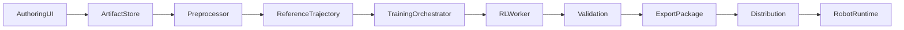
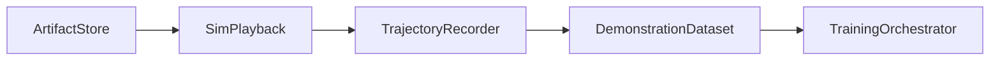
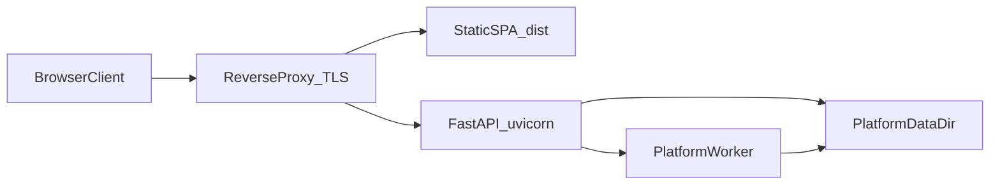

# Skill Foundry: архитектура модулей

Документ опирается на видение из [01_vision_and_approach.md](01_vision_and_approach.md). Ниже — модули конвейера, их входы/выходы и потоки данных.

## Общая схема

**Опциональный путь обогащения датасета** (логирование симуляции при проигрывании motion):

`DemonstrationDataset` может использоваться для offline imitation / инициализации политики параллельно или до этапа RL-only.

---

## 1. Authoring UI / SDK

**Назначение:** создание поз, keyframes, сборка motion и сценариев из действий; предпросмотр в MuJoCo.

**Входы:** действия пользователя (ползунки, сохранение кадра, порядок действий в сценарии).

**Выходы:** версионированные артефакты в хранилище (JSON keyframes, ссылки на motion, метаданные: робот, версия модели, пользователь, временные метки).

**Примечания:** остаётся источником истины для «намерения» пользователя; не обязан сам выполнять обучение.

---

## 2. Artifact store

**Назначение:** хранение и версионирование motion, сценариев, сырых keyframes; привязка к проектам и пользователям.

**Входы:** записи от Authoring UI, API.

**Выходы:** стабильные URI/идентификаторы артефактов для препроцессора и симуляции.

**Примечания:** желательна неизменяемость версий после публикации обучения (immutable snapshot для воспроизводимости).

---

## 3. Preprocessor service

**Назначение:** превращение разрежённых keyframes в **ReferenceTrajectory** фиксированной частоты: интерполяция (сплайны по углам; для базы/корня — согласованная схема, например SO(3) для ориентации при наличии); ресэмплинг (например 50 Гц); единая нумерация и порядок суставов.

**Локальный контур (MVP):** файловый `keyframes.json` → CLI (`skill-foundry-preprocess` или `python -m skill_foundry_preprocessing`) → `reference_trajectory.json` и лог `preprocess_run.json`. Подробности и поля лога: [04_phase0_contracts.md](../archive/04_phase0_contracts.md), раздел 6.

**Входы:** keyframes + тайминги из Artifact store; конфиг робота (число DOF, лимиты — для клиппинга при необходимости).

**Выходы:** бинарный/табличный файл референса (например `.npz` / HDF5) — контракт **ReferenceTrajectory v1** (поля см. в плане реализации, фаза 0).

**Примечания:** не выводит «истинные» контакты ступней из одних только углов; границы MVP должны быть описаны в контракте (только суставы vs явная модель корня).

---

## 3a. SimPlayback (фаза 2)

**Назначение:** проигрывание dense `reference_trajectory.json` в MuJoCo G1 из `unitree_mujoco` — предпросмотр и подготовка к записи демонстраций (см. опциональную ветку на диаграмме выше).

**Входы:** ReferenceTrajectory v1 (те же единицы и `joint_order`, что в [04_phase0_contracts.md](../archive/04_phase0_contracts.md)); путь к MJCF; шаг симуляции `dt`; режим **dynamic** (PD как у DDS-моста) или **kinematic** (углы в `qpos` + `mj_forward`).

**Выходы:** визуальный прогон в симуляторе и/или детерминированный лог `.npz` (headless) для проверки воспроизводимости.

**Спецификация и CLI:** [06_phase2_sim_playback.md](../archive/06_phase2_sim_playback.md); код: `unitree_sdk2_python/skill_foundry_sim/`, команда `skill-foundry-playback`.

---

## 4. Trajectory recorder (фаза 2.2)

**Назначение:** при проигрывании motion в MuJoCo логировать состояние и действие с частотой симуляции — **демонстрации с «истиной» физики** для imitation / hybrid training.

**Входы:** motion/scenario из Artifact store или уже интерполированный референс; сид симуляции.

**Выходы:** `DemonstrationDataset` v1 (эпизоды: `obs`, `act`, опционально `ref`, `done`, метаданные seed / симулятор / commit).

**Реализация:** `unitree_sdk2_python/skill_foundry_sim/` (`demonstration_dataset.py`, расширенный `PlaybackLog` с `motor_dq` и целевыми `q` по моторам); запись через CLI `skill-foundry-playback --demonstration-json …`.

**Спецификация:** [07_phase2_trajectory_recorder.md](../archive/07_phase2_trajectory_recorder.md).

**Примечания:** усиливает обучение, когда референс по суставам недостаточен или нужна стабилизация ног.

---

## 5. Training orchestrator

**Назначение:** очередь задач обучения (по запросу пользователя или батчами), выбор GPU-воркера, ретраи, таймауты, агрегация статусов.

**Входы:** задание (ID артефакта, тип: только референс / + демонстрации, гиперпараметры по умолчанию или пресеты).

**Выходы:** job id, ссылка на логи и метрики, ссылка на чекпоинты после успеха.

**Реализация (MVP платформы):** SQLite, один asyncio-воркер в процессе FastAPI, изоляция workspace по пользователю — см. [11_phase5_platform.md](../archive/11_phase5_platform.md). Горизонтальное масштабирование (Redis, отдельные GPU-воркеры и т.д.) — возможное развитие.

**Примечания:** в общем виде технология очереди (RabbitMQ, Kafka, облачные очереди) остаётся деталью реализации для крупных деплоев.

---

## 6. RL worker (контейнер)

**Назначение:** изолированная среда обучения: симулятор (например MuJoCo + слой как в mjlab), параллельные среды, алгоритм (PPO и др.), функции наград (tracking, survival, energy), экспорт чекпоинтов.

**Входы:** ReferenceTrajectory и/или DemonstrationDataset; конфиг среды и робота; сиды.

**Выходы:** чекпоинты (`.pt`), тензборд/лог метрик, финальные скаляры для Validation.

**MVP (фаза 3.1):** Docker-образ и точка входа `skill-foundry-train` с аргументами `--config`, `--reference-trajectory`, опционально `--demonstration-dataset` — см. [08_phase3_rl_worker_docker.md](../archive/08_phase3_rl_worker_docker.md).

**Полное обучение (фаза 3.2):** среда MuJoCo, наблюдения, награды (tracking / survival / energy / jerk), PPO и критерии остановки — см. [09_phase3_env_rewards.md](../archive/09_phase3_env_rewards.md) (задача 3.2 в [03_implementation_plan.md](03_implementation_plan.md)).

**Опционально (фаза 3.3):** offline behavior cloning по `DemonstrationDataset` перед PPO — см. [09b_phase3_demonstration_bc.md](../archive/09b_phase3_demonstration_bc.md).

**Примечания:** число параллельных сред зависит от GPU и задачи; не фиксировать как константу в архитектуре.

---

## 7. Validation

**Назначение:** проверка порогов по метрикам (ошибка трекинга, доля падений, энергия); решение «принять / отклонить / предупредить»; человекочитаемое объяснение для UI («сценарий может быть физически недостижим»).

**Входы:** логи и метрики от RL worker; пороги политики продукта.

**Выходы:** статус валидации, отчёт; при отказе — без публикации в каталог или с пометкой.

**Реализация (фаза 6.1):** отчёт `validation_report.json`, CLI `skill-foundry-validate`, пороги в YAML, гейт публикации в платформе — см. [12_phase6_product_validation.md](../archive/12_phase6_product_validation.md). Не путать с **контрактной** валидацией JSON (фаза 0): [04_phase0_contracts.md](../archive/04_phase0_contracts.md) §5.

---

## 8. Export / packaging

**Назначение:** сборка **пакета навыка**: веса, **manifest** (список наблюдений, порядок, нормализация, dt, версия MJCF/робота, commit среды обучения), опционально ONNX.

**Входы:** лучший чекпоинт по метрикам; шаблон manifest.

**Выходы:** архив или объект в объектном хранилище, криптографическая целостность (опционально).

**Примечания:** без manifest рантайм на роботе не может безопасно воспроизвести политику.

---

## 9. Distribution

**Назначение:** каталог/маркетплейс навыков, права доступа, привязка к профилю пользователя, лицензии.

**Входы:** проверенный пакет от Export.

**Выходы:** возможность скачать/подписаться на навык для клиента робота.

---

## 10. Robot runtime

**Назначение:** на ПК робота или встроенном компьютере: загрузка пакета, проверка совместимости с manifest (включая SHA-256 весов, MJCF и референса), инференс (PyTorch/ONNX), формирование low-level команд в согласии с `unitree_sdk2` (или выбранным API), emergency-stop и лимиты на суставы/скорости/моменты по слою безопасности рантайма ([13_phase6_runtime_security.md](13_phase6_runtime_security.md)).

**Входы:** сенсоры в том формате, который ожидает политика (нужна калибровка и те же фильтры, что при обучении).

**Выходы:** поток команд моторам; телеметрия обратно на платформу (опционально).

---

## 11. Развёртывание платформы в продакшене (VPS)

**Исходный код (два репозитория):** бэкенд и SDK — **AUROSY_creators_factory_platform** (`web/backend`, `unitree_sdk2_python`, `docs/`). SPA — **AUROSY_creators_factory** (`web/frontend`): сборка даёт `dist/`, которую reverse proxy раздаёт как статику рядом с API. Пошаговый сценарий (VPS, env, proxy): [03_implementation_plan.md](03_implementation_plan.md). Запуск и OpenAPI бэкенда: [`web/README.md`](../../web/README.md).

**Назначение слоя:** внешний HTTPS; **единый origin** для статики и API (меньше проблем с CORS и WebSocket); процесс **FastAPI** с маршрутами `/api/*` и **WebSocket** `/ws/telemetry`; встроенный **asyncio worker** очереди Phase 5 при `G1_PLATFORM_WORKER_ENABLED`; персистентный каталог **`G1_PLATFORM_DATA_DIR`** (SQLite, workspace job’ов, пакеты).

**Связь с модулями выше:** **Authoring UI** — статика из `dist/` репозитория UI (после `npm run build` в `AUROSY_creators_factory/web/frontend`); **Artifact store**, **Training orchestrator** и **Distribution** в MVP платформы реализованы бэкендом и диском на сервере — см. [11_phase5_platform.md](../archive/11_phase5_platform.md). Тяжёлое обучение (**RL worker**) может выполняться в Docker на том же хосте (GPU) или на отдельной машине — см. [08_phase3_rl_worker_docker.md](../archive/08_phase3_rl_worker_docker.md).

**Альтернатива фронту:** статический хостинг (например Vercel) для UI и API на VPS — возможен; для единого origin чаще проще reverse-proxy на одном домене. Детали по Vercel для фронта — в репозитории UI (`docs/deployment/` и т.п.).

---

## Контракты между модулями (кратко)

| От | К | Артефакт |
|----|---|----------|
| Authoring | Artifact store | keyframes, motion, scenario JSON |
| Artifact store | Preprocessor | снимок версии артефакта |
| Preprocessor | Training / Sim | ReferenceTrajectory v1 |
| Sim playback | TrajectoryRecorder | DemonstrationDataset |
| Orchestrator | RL worker | job config + пути к данным |
| RL worker | Validation | метрики + чекпоинты |
| Validation | Export | одобренный чекпоинт |
| Export | Distribution | пакет + manifest |
| Distribution | Robot runtime | загружаемый пакет |

---

## Связанные документы

- Видение: [01_vision_and_approach.md](01_vision_and_approach.md).
- План внедрения (фазы и **продакшен на VPS**): [03_implementation_plan.md](03_implementation_plan.md).
- Бэкенд и OpenAPI: [`web/README.md`](../../web/README.md).
- Контракты Phase 0: [04_phase0_contracts.md](../archive/04_phase0_contracts.md).
- Проигрывание в симе (фаза 2): [06_phase2_sim_playback.md](../archive/06_phase2_sim_playback.md).
- RL worker Docker (фаза 3.1): [08_phase3_rl_worker_docker.md](../archive/08_phase3_rl_worker_docker.md).
- Среда и награды RL (фаза 3.2): [09_phase3_env_rewards.md](../archive/09_phase3_env_rewards.md).
- BC и демонстрации (фаза 3.3): [09b_phase3_demonstration_bc.md](../archive/09b_phase3_demonstration_bc.md).
- Manifest и экспорт (фаза 4): [10_phase4_manifest_export.md](../archive/10_phase4_manifest_export.md).
- Платформа: оркестратор обучения и каталог (фаза 5): [11_phase5_platform.md](../archive/11_phase5_platform.md).
- Продуктовая валидация и пороги (фаза 6.1): [12_phase6_product_validation.md](../archive/12_phase6_product_validation.md).
- Безопасность рантайма и данных (фаза 6.2): [13_phase6_runtime_security.md](13_phase6_runtime_security.md).
