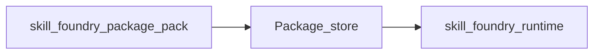

# Skill Foundry: Phase 6.2 — Runtime and data security

This document specifies task **6.2** from [03_implementation_plan.md](03_implementation_plan.md): **package integrity** at load time, **hardware safety limits** (torques, joint range, velocities), and pointers to **future** work (signing, telemetry audit). It ties together [Robot runtime] and [Distribution] from [02_architecture.md](02_architecture.md).

## Role in the pipeline

- **Phase 4** ([10_phase4_manifest_export.md](../archive/10_phase4_manifest_export.md)): `skill-foundry-package pack` writes `manifest.json` including **`weights.sha256`** (SHA-256 of the SB3 checkpoint zip).
- **Phase 5** ([11_phase5_platform.md](../archive/11_phase5_platform.md)): catalog ACL (who may download); transport trust (HTTPS in production) is an operator concern.
- **Phase 6.2 (this doc):** `skill-foundry-runtime run` verifies hashes, then runs the control loop with `SafetyMonitor` (MuJoCo and DDS).

## Package integrity (task 6.2.1)

| Check | Where | Description |
|--------|--------|-------------|
| JSON Schema | `check_compatibility` → `validate_export_manifest_dict` | Manifest shape (requires `jsonschema`). |
| Weights file | `check_compatibility` | File named `manifest.weights.filename` exists in package. |
| **`weights.sha256`** | `check_compatibility` | If present, must match on-disk hash of the weights file. If **absent**, runtime fails unless **`--allow-missing-weights-sha256`** (legacy bundles only). New packages from `pack` always include `sha256`. |
| MJCF | `check_compatibility` | Local `--mjcf` SHA-256 must match `robot.mjcf_sha256`. |
| Reference | `check_compatibility` | Bundled or `--reference` file must match `provenance.reference_sha256` when set. |
| Observation / action | `check_compatibility` | `vector_dim` and `action.dim` aligned with G1 29-DoF MVP. |

**Cryptographic signing** of the whole bundle (e.g. detached signature + pinned public key on the robot) is **Future** — not required for the current MVP.

## Hardware and simulation safety (task 6.2.2)

Implementation: `packages/skill_foundry/skill_foundry_runtime/safety.py`, `g1_joint_limits.py`, `loop_mujoco.py`, `dds_g1.py`.

| Mechanism | MuJoCo | DDS (hardware) |
|-----------|--------|----------------|
| Joint limits | From MJCF actuator → joint ranges (`actuator_joint_limits`) | **`g1_29dof_motor_q_limits()`** — same numeric ranges as `unitree_mujoco/.../g1_29dof.xml` motor order |
| Torque | `SafetyMonitor`: clip \|τ\| to `max_abs_tau`; stop if clipped too many steps in a row | Same monitor on **model** τ from `residual_pd_torque`. **Note:** `LowCmd` uses `tau=0` with position PD (`q`, `dq`, `kp`, `kd`); torque checks detect inconsistent / dangerous PD commands early, not motor torque caps in firmware. |
| Velocity | Optional: `SafetyConfig.max_abs_dq` | Default **30 rad/s** cap on \|motor_dq\| and \|dq_des\| unless overridden with `--max-abs-dq` |
| CLI | `--max-abs-tau`, `--max-abs-dq` (off if omitted) | `--max-abs-tau`, `--max-abs-dq` (default 30 if omitted) |

**CLI flags** (`skill-foundry-runtime run`):

- `--allow-missing-weights-sha256` — allow legacy manifests without `weights.sha256` (not for production).
- `--max-abs-dq` — maximum absolute joint velocity (rad/s) for measured `motor_dq` and commanded `dq_des`; violations use the same streak counter as other safety stops.

## Telemetry audit (task 6.2.3, Future)

Structured logging of safety stops, hash verification outcomes, and run metadata to the platform or SIEM is **out of scope** for the current implementation; plan as an extension when the orchestrator exposes a log sink.

## Field trial checklist (DoD)

Use this before running on hardware or an unattended stand.

1. **Environment:** cleared workspace, e-stop reachable, personnel trained.
2. **Package:** built with current `skill-foundry-package pack` so **`weights.sha256`** is present; do **not** use `--allow-missing-weights-sha256` in production.
3. **Provenance:** `robot.mjcf_sha256` and `provenance.reference_sha256` match the MJCF and reference you intend to use (`check_compatibility` must pass).
4. **Network:** DDS on the correct interface (`--network`); no conflicting high-level motion modes.
5. **Limits:** review `--max-abs-tau` and `--max-abs-dq` for your robot and skill; joint limits on DDS follow G1 MJCF (see `g1_joint_limits.py`).
6. **Platform:** if the bundle was downloaded from the API, trust HTTPS and tenant isolation ([11_phase5_platform.md](../archive/11_phase5_platform.md)); optional checksum-in-response remains Future.

## Related code

- `skill_foundry_runtime/compatibility.py` — `check_compatibility`, `sha256_file`
- `skill_foundry_runtime/cli.py` — `run` subcommand flags
- `skill_foundry_runtime/safety.py` — `SafetyConfig`, `SafetyMonitor`
- `skill_foundry_runtime/g1_joint_limits.py` — G1 29-DoF `q_low` / `q_high`
- `skill_foundry_export/packaging.py` — sets `manifest.weights.sha256`
- `docs/skill_foundry/contracts/export/export_manifest.schema.json` — `weights.sha256`

## Definition of done (task 6.2)

- New bundles record and verify **weights SHA-256** at runtime (with an explicit escape hatch for legacy tarballs).
- DDS uses **realistic joint limits** and **velocity monitoring** (default cap on hardware).
- This document and cross-links describe behavior and the field checklist.
