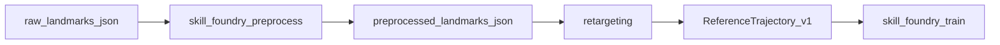

# Preprocess Pipeline (FreeMoCap / MediaPipe)

## Purpose

Raw landmark sequences from FreeMoCap and MediaPipe often contain:

- frame-to-frame jitter,
- short tracking dropouts,
- inconsistent confidence.

The preprocess pipeline smooths and normalizes those sequences before `build_reference` and `train`.

## Pipeline Placement



## Canonical Output

Output schema: `aurosy_preprocessed_landmarks_v1`

Required fields:

- `landmarks`: `[N, 33, 3]`
- `confidences`: `[N, 33]`
- `timestamps_ms`: `[N]`
- `preprocessing_config`: filter and threshold settings
- `source_format`: source marker (`freemocap`, `aurosy_video_landmarks_v1`, etc.)

Optional:

- `quality_metrics`: jitter and confidence diagnostics

## Filters

### Savitzky-Golay

- smooths each coordinate time series while preserving motion shape;
- confidence mask is applied first (`confidence_threshold`);
- missing points are interpolated before filtering.

### Kalman (constant velocity)

- tracks position+velocity for each coordinate;
- uses confidence to decide whether to apply measurement update or prediction-only step;
- fills short low-confidence gaps robustly.

### Combined mode

`both` runs:

1. Savitzky-Golay
2. Kalman

This is the default in motion pipeline automation.

## CLI

```bash
skill-foundry-preprocess-motion input.json -o preprocessed_landmarks.json \
  --filter both \
  --window 7 \
  --polyorder 2 \
  --confidence-threshold 0.3 \
  --process-noise 0.01 \
  --measurement-noise 0.1
```

## API / Orchestration Integration

`run_motion_pipeline_action` supports:

- explicit action: `preprocess_motion`,
- automatic preprocess inside `build_reference` for landmark artifacts.

The persisted state now includes:

- stage: `stages.preprocess`,
- artifact: `preprocessed_artifact`.

## Quality Metrics

Current metrics:

- `raw_jitter`
- `smoothed_jitter`
- `jitter_reduction_pct`
- `low_confidence_ratio`

These metrics are stored in `quality_metrics` and can be surfaced in UI/validation tooling.
